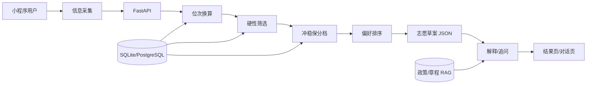

# 广东高考志愿填报 Agent — 产品与能力说明

> 本文档定义 Agent 的能力边界、工作流与落地方式。  
> 实现代码见 `server/`、`miniprogram/`；运行时系统提示见 `agent/prompts/system.md`；政策要点见 `docs/guangdong-policy.md`。

---

## 1. 产品范围（写死，勿泛化）

| 维度 | 当前版本 |
|------|----------|
| 省份 | **仅广东省** |
| 批次 | **仅本科普通批**（不含春考、提前批、艺术/体育、专科等） |
| 考试模式 | 新高考 **3+1+2**（首选物理/历史 + 再选 2 门） |
| 志愿单位 | **院校专业组**（平行志愿） |
| 志愿数量 | 近年约 **45 个**院校专业组（以当年考试院文件为准） |
| 交付形态 | **微信小程序** + FastAPI 后端 |
| 扩展计划 | 其他省份/批次后续迭代，本版不做 |

**产品边界（必须对用户可见）：**

- 仅提供参考建议与解释，**不替代**广东省志愿填报官方系统。
- 数据以当年 **招生计划 + 一分一段 + 历年录取** 为准，并标注 **数据年份与来源**。
- 分数、位次、投档相关结论须 **可溯源**（用了哪张表、哪年、哪个专业组）。

---

## 2. Agent 要做什么：四层能力

避免做成「万能高考咨询」，按层拆分：

| 层级 | 能力 | 广东示例 |
|------|------|----------|
| **信息层** | 查政策、位次、院校专业、往年录取 | 「物化生 580 分大概什么位次？」 |
| **匹配层** | 冲/稳/保分档、生成志愿序列表 | 「冲 8 稳 22 保 15，共 45 个组」 |
| **决策层** | 权衡城市 / 学校 / 专业 / 就业 | 「更看重广深计算机，还是 985 牌子？」 |
| **交付层** | 可执行草案 + 理由 + 风险 | 序号表 + 每条依据位次与风险说明 |

**职责划分（重要）：**

| 模块 | 谁负责 | 说明 |
|------|--------|------|
| 位次换算、选科硬筛、冲稳保分档、排序 | **规则引擎**（`server/services/`） | 必须写进代码/SQL，不能只靠 Prompt |
| 自然语言解释、追问、偏好澄清 | **LLM**（`agent/prompts/system.md` + `/api/v1/explain`） | 只解释 API 返回的 `evidence`，禁止编造数据 |

---

## 3. 核心难点：数据与规则（约 70% 工作量）

### 3.1 数据清单（按优先级）

1. **一分一段表**（省、年、物理/历史）→ 分数 ↔ 位次  
2. **历年院校专业组录取**（最低分、最低位次、计划人数）  
3. **当年招生计划**（院校、专业组、选科要求、计划数）  
4. **政策规则**（平行志愿、投档比例、专业组内调剂等）  
5. **辅助信息**（专业介绍、学科评估、就业/深造等，适合 RAG，不宜单独算录取概率）

### 3.2 与本仓库的对应关系

| 数据 | 表名 / 文件 | 状态 |
|------|-------------|------|
| 一分一段 | `score_rank` / `data/samples/score_rank_sample.csv` | 示例数据，需换官方全量 |
| 招生计划 | `enrollment_plan` / `enrollment_plan_sample.csv` | 同上 |
| 历年录取 | `admission_history` / `admission_history_sample.csv` | 同上 |
| 导入脚本 | `server/scripts/init_db.py` | 已有，待扩展 `import_data.py` |

---

## 4. 系统架构

### 4.1 标准工作流（7 步）

1. **采集**：首选科目（物理/历史）、再选 2 门、总分、可选位次、偏好（城市/专业关键词/院校层次）、是否接受调剂。  
2. **换算**：`POST /api/v1/rank/lookup` 分数 → 位次；若用户自报位次则校验合理性。  
3. **硬筛**：选科不满足、非本科普通批、计划人数为 0 → 剔除。  
4. **分档**：按近 3 年专业组 **最低位次** 划分冲 / 稳 / 保（见第 5 节）。  
5. **排序**：同档内按城市、专业、层次偏好打分。  
6. **生成草案**：最多 45 条，含 `order、tier、school、group、evidence`。  
7. **追问迭代**：用户改偏好 → 重新调用 `POST /api/v1/recommend`，禁止仅在对话里「口头改志愿」。

### 4.2 API 契约（Agent / 小程序必须遵守）

| 接口 | 用途 |
|------|------|
| `POST /api/v1/rank/lookup` | 分数 → 位次 |
| `POST /api/v1/recommend` | 冲稳保志愿列表（核心） |
| `POST /api/v1/explain` | 单条志愿解读（LLM，可降级为模板） |

`recommend` 返回字段中，解释层只能引用：`tier`、`ref_min_rank`、`student_rank`、`plan_count`、`evidence`（含 `data_year`、`history_years`）。

---

## 5. 冲稳保规则（代码实现，非 Prompt）

以 **全省位次** 为主（比裸分数稳）。实现见 `server/services/recommend_service.py`。

| 档位 | 含义（相对考生位次 vs 近年最低位次） |
|------|--------------------------------------|
| **冲** | 考生位次 **差于** 历年最低位次约 15%–30%（往年更难录） |
| **稳** | 差值在 **±10%** 以内 |
| **保** | 考生位次 **优于** 最低位次约 15% 以上 |

**须叠加的风险标注（LLM 或规则输出）：**

- **专业组**：整组投档；组内调剂规则写入 `explain`，引导用户读招生章程。  
- **大小年**：如「去年低位、前年高位」须在 `evidence` 或文案中提示。  
- **计划变动**：招生人数骤增/骤减 → 调档位或升风险，勿静态沿用去年位次。

默认条数建议（可配置）：冲 8 / 稳 22 / 保 15，合计不超过 45。

---

## 6. 「录取成功概率」怎么处理（产品规划修正）

原文档提到「每条建议标注录取成功概率百分比」。建议调整如下：

| 方案 | 说明 | 推荐 |
|------|------|------|
| **A. 仅展示档位** | 冲 / 稳 / 保 + 文字风险 | ✅ **当前 MVP**，与规则引擎一致 |
| **B. 参考概率区间** | 如「冲档参考约 20%–35%」，注明模型简化、非官方 | 需单独产品文案与法务审阅 |
| **C. 精确百分比** | 如「72.3%」 | ❌ 不推荐：缺省招人数、同分分布、投档线波动，易误导且违规风险高 |

若上线 B：必须由 **历史录取位次 + 当年计划** 统计得出，并固定免责声明；**禁止** LLM 直接生成百分比。

---

## 7. Prompt / Skill 硬性约束

与 `agent/prompts/system.md` 保持一致，补充如下：

- 缺 **首选科目 + 再选 2 门 + 分数（或位次）** 时，**禁止**输出具体院校专业组名单。  
- 每条推荐必须包含：**档位、数据年份、参考位次、主要风险**。  
- 政策不确定时：明确「以广东省教育考试院当年文件为准」，给出 [eea.gd.gov.cn](https://eea.gd.gov.cn/) 等查询路径。  
- 禁止「保录取」「100% 上岸」等表述。  
- 结尾固定免责声明（与小程序结果页一致）。

**对话示例（合规）：**

> 用户：600 分物理类能上中大吗？  
> Agent：请先确认选科。若已满足，根据 2024 年参考最低位次 X，您当前位次 Y 属于【冲】档，存在落选风险；最终须以当年投档结果为准。

---

## 8. 合规与隐私

- 分数、位次、意向：**最小化采集**；存储加密；支持用户删除。  
- 数据来源注明版权与更新频率；**勿爬取**明确禁止抓取的站点。  
- 对外收费时避免「保录取」承诺；小程序需隐私政策与用户协议。  
- 详见 `docs/miniprogram-deploy.md`。

---

## 9. 落地检查清单

### 数据

- [ ] 导入广东省当年一分一段（物理/历史）  
- [ ] 导入本科普通批全量招生计划  
- [ ] 导入近 3 年院校专业组录取位次  
- [ ] 用 20+ 真实案例人工抽检冲稳保是否合理  

### 产品

- [ ] 小程序：采集页字段与广东 3+1+2 一致  
- [ ] 结果页：档位 + 位次依据 + 免责声明  
- [ ] 解读页：走 `/explain` 或模板降级  

### Agent

- [ ] `system.md` 与本文档范围一致  
- [ ] 所有名单类回答走 `recommend` API  
- [ ] 概率若展示，仅用档位或区间，不用 LLM 编造  

---

## 10. 文档与代码索引

| 文件 | 用途 |
|------|------|
| `agent/高考志愿填报.md` | 本文：产品与 Agent 总纲 |
| `agent/prompts/system.md` | LLM 系统提示（运行时） |
| `docs/guangdong-policy.md` | 广东政策摘要 |
| `docs/architecture.md` | 技术架构 |
| `server/services/recommend_service.py` | 冲稳保引擎 |
| `miniprogram/pages/intake/` | 用户采集 |
| `miniprogram/pages/result/` | 志愿列表展示 |

---

## 修订记录

| 日期 | 说明 |
|------|------|
| 2026-05 | 对齐广东本科普通批 + 小程序；明确规则引擎与 LLM 分工；修正「录取概率」表述；补充 API 与检查清单 |
